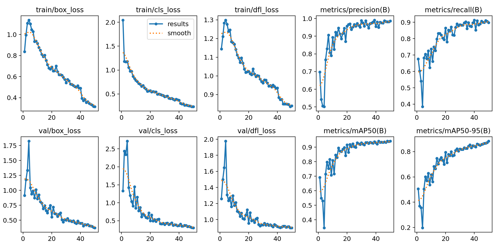

# 🧯 Space Station Tools Object Detection using YOLOv8

This repository contains our solution for the BuildWithIndia 2.0 Hackathon organized by SunHacks, where we trained a YOLOv8 model to detect **Fire Extinguishers**, **Tool Boxes**, and **Oxygen Tanks** in Space Station environments using computer vision.

---

**👥 Team**

Team Name: **Codies**

Hackathon: **BuildWithIndia 2.0 (SunHacks) – Duality AI Challenge**

**Team Leader:**

Samarth Sharma – samarth120904@gmail.com

**Team Members:**

Vaibhav Sharma – vaibhavsh0120@gmail.com

Prithvi Singh – prithvis3804@gmail.com

Parth Garg – 2300300100120@ipec.org.in

---

## 🚀 Project Overview

Design a computer vision object detection model that can help
automate tasks in space environments by enabling robots to visually
identify and locate essential tools during missions.

### 📌 Objects Detected:
- 🔥 Fire Extinguisher
- 🧰 Tool Box
- 🧪 Oxygen Tank

---

## 📊 Final Results

After training and evaluation, the model achieved:

| Class            | Precision | Recall | mAP@0.5 | mAP@0.5:0.95 |
|------------------|-----------|--------|---------|---------------|
| Fire Extinguisher| **1.000** | 0.936  | **0.977** | 0.914 |
| Tool Box         | 0.992     | 0.883  | **0.948** | 0.916 |
| Oxygen Tank      | 0.965     | 0.873  | **0.901** | 0.822 |
| **Overall**      | 0.986     | 0.898  | **0.942** | **0.884** |

> ✅ Model: `YOLOv8m`  
> ✅ Framework: PyTorch + Ultralytics + ONNX

---

## 📁 Folder Structure

```bash

HackWithDelhi2.0/
┣ 📁 data/              ← ⚠️ Copy this folder manually from Dataset (see below section)
┃ ┣ 📁 train/
┃ ┃ ┣ 📁 images/
┃ ┃ ┗ 📁 labels/
┃ ┣ 📁 val/
┃ ┃ ┣ 📁 images/
┃ ┃ ┗ 📁 labels/
┃ ┣ 📁 predict/
┃ ┃ ┣ 📁 images/
┃ ┃ ┗ 📁 labels/
┃ ┗ 📄 data.yaml
┣ 📁 runs/              ← YOLO training logs and result artifacts
┣ 📜 Train\_YOLOv8.ipynb ← 📓 Full notebook: training, predicting & exporting
┣ 📜 train.py           ← 🔁 Training script (alternative to notebook)
┣ 📜 predict.py
┣ 📜 visualize.py       ← used for metrics/image display
┣ 📜 yolo_params.yaml   ← Config file
┣ 📜 yolov8m.pt         ← Trained model weights
┣ 📜 best.onnx          ← Model Exported as ONNX
┣ 📜 BuildWithDelhi2.0_Report.pdf ← Final report
┗ 📜 README.md          ← 📄 You're here!

```

---

## 📦 Dataset

The dataset used in this project is not included in this GitHub repo due to its size (~3.9 GB).  
Please download it from the official source:

862 Training Image | 154 Testing Image

🔗 **[Download from Duality (Account Required)](https://falcon.duality.ai/secure/documentation/hackathon?utm_source=hackathon&utm_medium=instructions&utm_campaign=sunhacks)**

### 📂 After Downloading:

1. Extract the contents.
2. Copy the entire `data/` folder into the root directory of this repo.
3. Ensure the folder structure looks like this:

---

## 🧠 Model Training & Export

All training, validation, and ONNX export steps are documented in:

📓 `Train_YOLOv8.ipynb`

Exported model:

```bash
runs/detect/train/weights/best.onnx  ✅
```

---

## 📱 Flutter Integration (via ONNX)

This repo is designed to integrate the exported ONNX model (`best.onnx`) into a mobile app using **Flutter**.


---

## 📸 Result Samples

Here are visual examples of how our YOLOv8 model detects objects like fire extinguishers, toolboxes, and oxygen tanks in real-world images.

### 🔹 Validation Batch Predictions
Visualized predicted labels during validation phase using `val_batch1_labels.jpg`:


### 🔹 Training Batch Samples
Sample training images used by YOLOv8 (`train_batch1.jpg`) showing bounding boxes during model training:


## 📊 Training Metrics

The following plot summarizes the training progress over 50 epochs, including loss curves and accuracy metrics such as precision, recall, and mean Average Precision (mAP):



> All these visuals are automatically generated and stored in the `runs/detect/train/` directory after training.

## 🖼️ ToolFinder App Screenshots (BONUS)

This mobile interface demonstrates real-time object detection using the trained YOLOv8 ONNX model inside a modern Flutter app.

| Home Screen                   | Image Preview                       | Detection Result                  |
| ----------------------------- | ----------------------------------- | ---------------------------------- |
|  |  |  |
| Live Detection                | Settings Threshold                       | Settings Object                  |
|  |  |  |


**Features shown above:**

* 🚀 Smooth glassmorphism interface with dark mode UI
* 📸 Capture from camera or select from gallery
* 🧠 On-device ONNX inference (single image at a time)
* 🎯 High-confidence bounding boxes using post-processing and NMS

> ToolFinder turns your phone into an **AI vision assistant** capable of real-time object detection — ideal for industrial, robotics, and even space applications.

### 📦 Download APK (Android Release)

You can try the ToolFinder AI app on your Android device:

🔗 **[📥 Download ToolFinder Release APK](https://github.com/Vaibhav0120/HackWithDelhi2.0/releases/download/v1.3.0/app-release.apk)**

> Built with Flutter • ONNX Runtime for mobile inference • Optimized for low-latency object detection

⚠️ Make sure to enable **"Install from Unknown Sources"** in your device settings.
